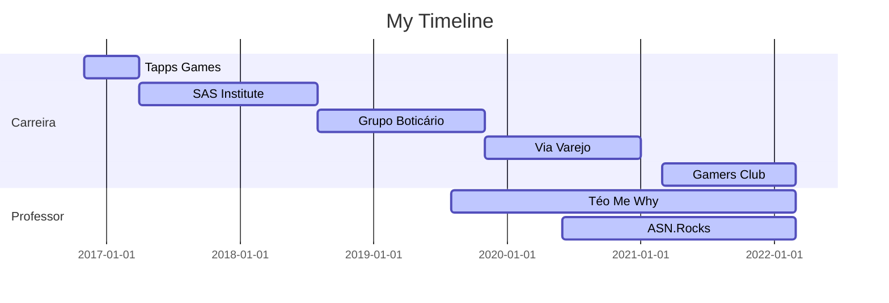

### Hi, I'm Robison

 
   

## Professional Experience

🏦: Data Scientist - Cizi (10.2021 - Atual)

💻:	Bussiness Intelligence Consultant (05.2021 - 10.2021)

🏨:	Data Analyst - WAM Hotéis (03.2018 - 04.2021)

🖥️: Administrative Manager	 (10.2012 - 03.2018)

## Academic Background 

:newspaper_roll: MBA Data Science and Analytics, USP-ESALQ - Brazil (2021– 2023) 

:newspaper_roll: MBA Business Management, Controllership and Corporate Finance IPOG -Brazil (2017- 2019) 

:newspaper_roll: Bachelor Business Administration, PUC-Goiás - Brazil (2007-2011) 
