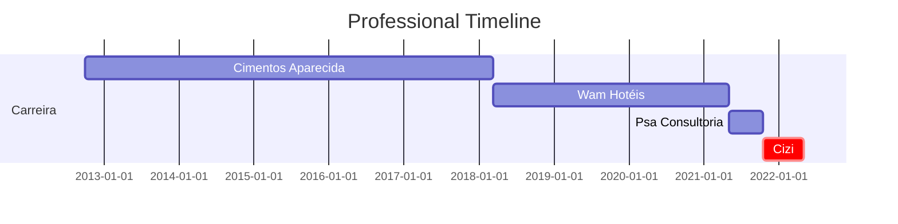

### Hi, I'm Robison

I am a Data Driven Professional, for the last 4 years I have been helping companies in 3 different industries, I am specialized, to solve critical problems with data analysis, Business Intelligence and machine learning models. 

I contributed to financial planning, supported several clients as a BI consultant, I helped the company with machine learning (suṕervisioned/unsupervisioned Alogritms) , offering solutions to issues such as, chargeback, credit hate and fraud prevention.

Stack:

           

## Professional Experience

🏦: Data Scientist - Cizi (10.2021 - Atual)

💻:	Bussiness Intelligence Consultant (05.2021 - 10.2021)

🏨:	Data Analyst - WAM Hotéis (03.2018 - 04.2021)

🖥️: Administrative Manager	 (10.2012 - 03.2018)

## Academic Background 

:newspaper_roll: MBA Data Science and Analytics, USP-ESALQ - Brazil (2021– 2023) 

:newspaper_roll: MBA Business Management, Controllership and Corporate Finance IPOG -Brazil (2017- 2019) 

:newspaper_roll: Bachelor Business Administration, PUC-Goiás - Brazil (2007-2011) 

## Connect With Me
  

Email:
robison.nunes@outlook.com  

## ⚡ GitHub Stats

