### Hi, I'm Robison

Data engineer with over 12 years' experience in designing and optimizing data pipelines, ETL processes and scalable architectures on cloud platforms (AWS, Azure) and on-premises systems. Proficient in big data technologies (Spark, Hadoop), SQL and Python, with experience in performance optimization and automation. Skilled in creating data warehouses and transforming raw data into actionable insights to enable advanced analysis. Experience in agile methodologies and effective collaboration with cross-functional teams to align data strategies with business goals. Adept at simplifying technical concepts for non-technical stakeholders, generating business value through innovative data solutions.

Stack:

```mermaid

gantt
dateFormat  YYYY-MM-DD
title Professional Timeline

section Carreira
Cimentos Aparecida    :2012-10-01,2018-03-10
Wam Hotéis            :2018-03-13,2021-04-30
Psa Consultoria       :2021-05-03,2021-10-12
Vortex                :2021-10-15,2022-05-19
Tata Consultancy Services :2022-07-01,2023-04-01
RedIt :crit,2023-04-06,2025-03-31
```

           

## Professional Experience

💻:	Data Engineer - Redit (Sonae Group) (04.2023 - 03.2025)  

💻:	Bussiness Intelligence Developer - Tata Consultancy Services (07.2022 - 03.2023)  

🏦: Data Scientist - Cizi (10.2021 - 05-2022)

💻:	Bussiness Intelligence Developer - Psa Consultoria (05.2021 - 10.2021)

🖥️:	Bussiness Intelligence Developer - WAM Hotéis (03.2018 - 04.2021)

🖥️: Bussiness Intelligence Developer	 (10.2012 - 03.2018)

## Academic Background 

:newspaper_roll: MBA Data Science and Analytics, USP-ESALQ - Brazil (2021– 2023) 

:newspaper_roll: MBA Business Management, Controllership and Corporate Finance IPOG -Brazil (2017- 2019) 

:newspaper_roll: Bachelor Business Administration, PUC-Goiás - Brazil (2007-2011) 

## Connect With Me
  

Email:
robison.nunes@outlook.com  

## ⚡ GitHub Stats

